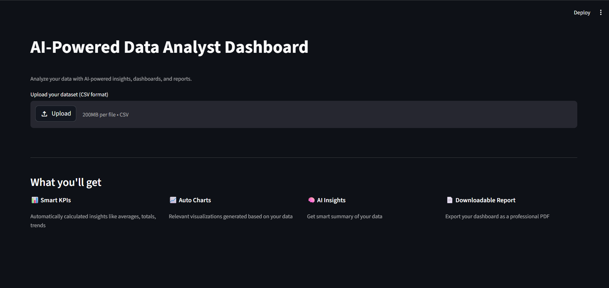
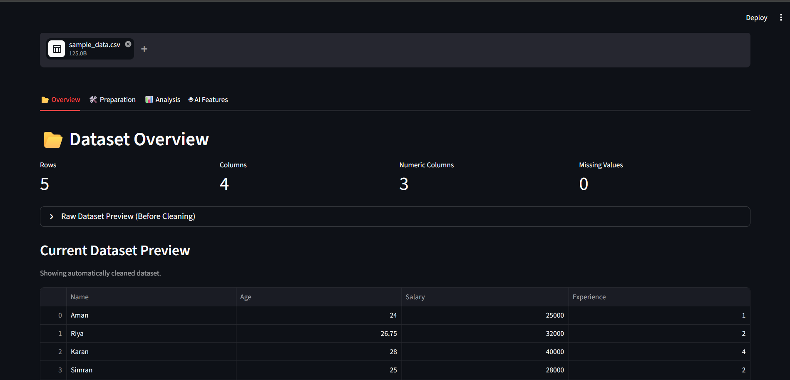
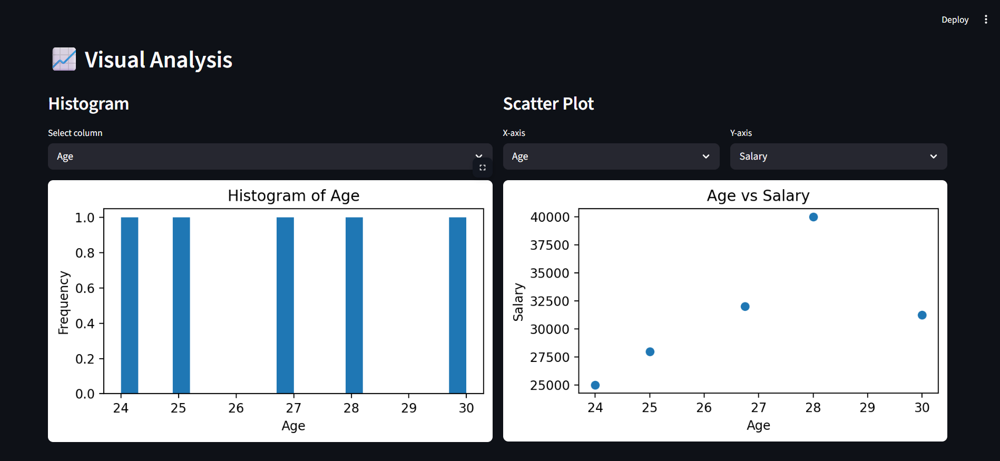
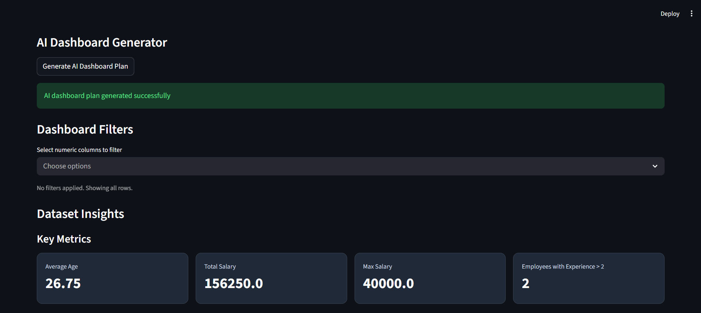

# 🚀 AI-Powered Data Analyst Dashboard

## 🚀 Live Demo
👉 https://ai-data-analyst-dashboard-nb6ezxeynakvdghkb8rbsv.streamlit.app/


## 📌 Overview
An interactive Streamlit application that allows users to upload a CSV file and automatically generate **data insights, KPIs, visualizations, and downloadable reports**.


## 📊 Features

### 📈 Smart KPIs
- Automatically calculates key metrics:
  - Average
  - Total
  - Maximum
  - Conditional counts

### 📊 Auto Charts
- Generates relevant visualizations:
  - Histogram
  - Bar Chart (only when meaningful)
  - Scatter Plot
- Avoids cluttered or misleading charts

### 🧠 AI Insights
- Provides explanations for generated charts
- Suggests meaningful analysis based on data

### 📄 Downloadable Report
- Export full dashboard as PDF
- Includes KPIs + charts + insights

### 🎛️ Interactive Filters
- Filter numeric columns dynamically
- Updates dashboard in real-time


## 🖥️ Tech Stack

- Streamlit (UI)
- Pandas (Data Processing)
- Matplotlib (Visualization)
- ReportLab (PDF Generation)


## ⚙️ How to Run

### 1. Clone repo
```bash
git clone https://github.com/your-username/ai-data-analyst-dashboard.git
cd ai-data-analyst-dashboard
```
### 2. Install dependencies
```bash
pip install -r requirements.txt
```
### 3. Run app
```bash
streamlit run app.py
```


## 📂 How it Works

1. Upload CSV file
2. Dashboard automatically:
- Cleans data
- Generates KPIs
- Creates charts
- Provides insights
3. Apply filters
4. Download report


## 🧠 Key Highlights
- Works with any dataset
- Avoids bad visualizations automatically
- Clean dashboard layout (Power BI inspired)
- End-to-end pipeline: Upload → Analyze → Export


## 📸 Screenshots

### Landing Page


### Data Overview


### Analysis / Charts


### KPIs Dashboard



## 🚀 Future Improvements
- Advanced AI insights
- More chart types
- Deployment support


## 👩‍💻 Author
Gunpreet Kaur
BCA Student | Aspiring Data Analyst


## ⭐ Support
If you like this project, give it a ⭐
